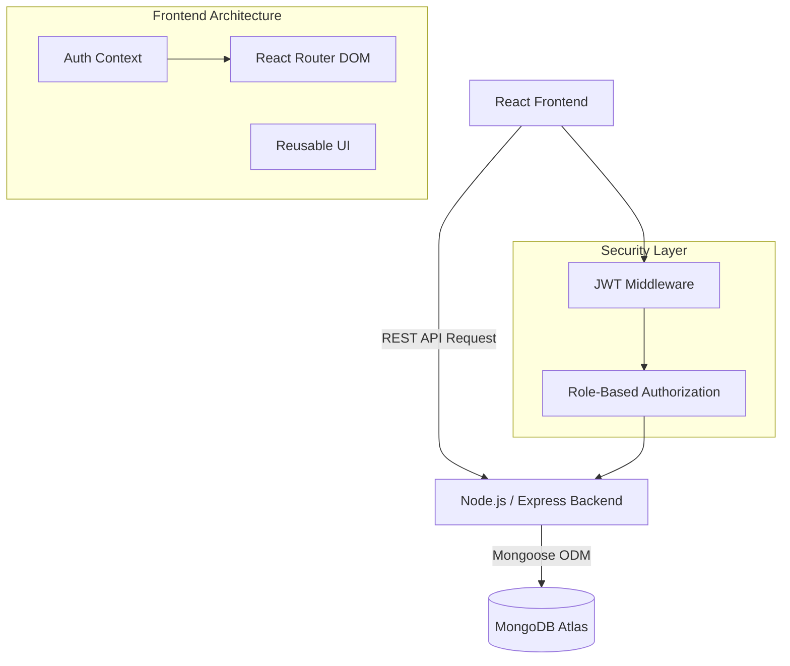

# MediNexus: Advanced Patient Scheduling & Clinical Management Suite

A modern MERN stack application designed to streamline the doctor-patient appointment process. Built with TypeScript, React, and Node.js.

## Professional Final Year Project Details
- **Project Name:** MediNexus Healthcare Ecosystem
- **Developer:** [User Name]
- **Duration:** April 2026 - Present
- **Stack:** MongoDB, Express, React, Node.js (MERN), TypeScript

## Features (Completed on Day 3)
- **Multi-Role Authentication:** Separate portals for Patients, Doctors, and Administrators.
- **Doctor Portal:** Comprehensive management of Appointments, Sessions, and Patient records.
- **Profile Settings:** Users can securely update their name, email, and password.
- **Advanced Search:** Real-time search across Doctors, Sessions, and Patient lists for seamless navigation.
- **Dynamic Scheduling:** Doctor-specific session availability with automated conflict prevention.
- **Intelligent Booking:** Patient booking flow with seat capacity management and real-time status updates.

## Technical Architecture

The architecture embodies a modern, component-driven MERN stack approach designed for scalability and high performance.



- **Frontend:** React 18, TypeScript, Lucide Icons, Custom CSS for premium UI.
- **Backend:** Node.js, Express, strict TypeScript typing schemas.
- **Security:** Stateless JWT authentication, role-based route protection, Bcrypt password hashing.
- **Persistence:** Mongoose ODM with relational population between User, Patient, Doctor, Schedule, and Appointment records.

## Project Structure
```text
medinexus-mern/
├── client/              # React frontend
│   ├── src/
│   │   ├── components/  # Reusable UI
│   │   ├── pages/       # Role-specific views
│   │   └── services/    # API integration
└── server/              # Express backend
    ├── src/
    │   ├── controllers/ # Business logic
    │   ├── models/      # Mongoose Schemas
    │   └── routes/      # REST Endpoints
```

## Setup & Installation

### Prerequisites
- Node.js & npm
- MongoDB URI

### Steps
1. Clone the repository.
2. Install dependencies:
   ```bash
   cd server && npm install
   cd ../client && npm install
   ```
3. Create `.env` in `server/` with `MONGO_URI` and `JWT_SECRET`.
4. Start development mode:
   ```bash
   # Terminal 1
   cd server && npm run dev
   # Terminal 2
   cd client && npm run dev
   ```
