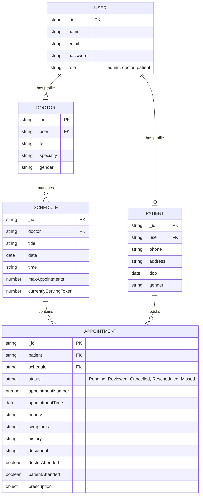
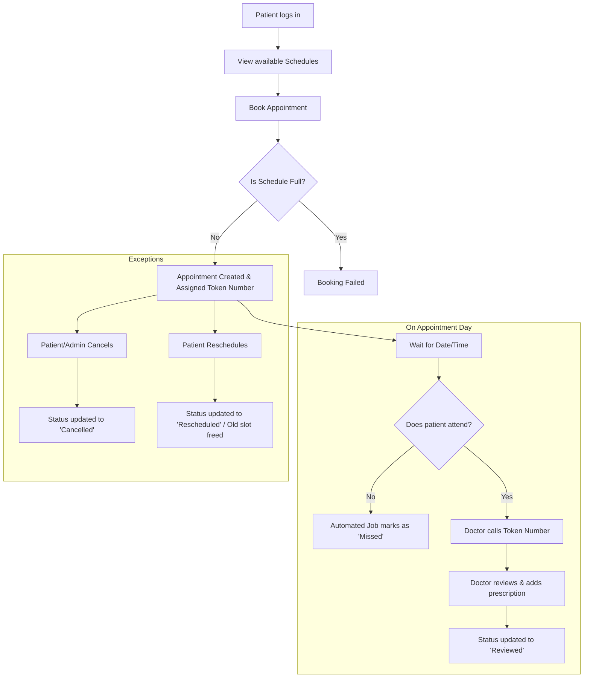

# Medinexus System Architecture & Testing Documentation

This document outlines the core architecture, data relationships, user workflows, and primary test cases for the Medinexus appointment management system.

## 1. Entity-Relationship (ER) Diagram

The following diagram illustrates the relationship between the primary data models in MongoDB.

## 2. Appointment Workflow (Flow Chart)

The following flowchart outlines the lifecycle of a patient's interaction with the booking and attendance system.

## 3. Core System Test Cases

The following test cases cover the critical pathways for the system to ensure production readiness.

| Test Case ID | Module | Scenario | Pre-conditions | Action | Expected Result |
|--------------|--------|----------|----------------|--------|-----------------|
| **TC_01** | Auth | Valid Login | User registered | Enter valid email & password | Login successful, redirect to correct role dashboard |
| **TC_02** | Admin | Add Doctor | Admin logged in | Fill doctor form & submit | New doctor created; email must be unique; shows in list |
| **TC_03** | Admin | Create Schedule | Doctor exists | Select doctor, pick **future date**, submit | Schedule created, visible to patients |
| **TC_04** | Admin | Invalid Schedule | Doctor exists | Select **past date**, submit | Validation Error: "Cannot schedule a session in the past" |
| **TC_05** | Patient | Book Appointment | Schedule has open slots | Click book, enter symptoms, submit | Appointment created, sequential token (APT-...) assigned |
| **TC_06** | Patient | Queue Wait Time | Appointment booked | Doctor increments serving token | Patient UI dynamically updates wait time correctly |
| **TC_07** | Doctor | Mark Reviewed | Patient attended | Click "Review", add prescription | Status changes to "Reviewed", prescription saved |
| **TC_08** | System | Attendance Job | Pending past appointment | 5 mins pass after appointment time | Server cron job auto-updates status to "Missed" |
| **TC_09** | Patient | Print PDF | Booking exists | Click "Print PDF" | PDF confirmation opens, correctly formats APT-YYYYMMDD-XX |
| **TC_10** | System | File Upload | Creating booking | Upload PDF/Image, submit | File uploaded safely, accessible via backend URL |

> [!TIP]
> Use these test cases as a foundation for implementing End-to-End (E2E) testing frameworks like Cypress or Playwright.
